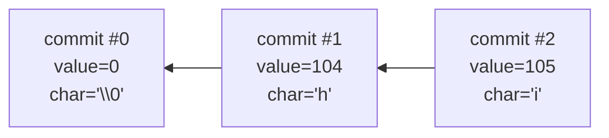
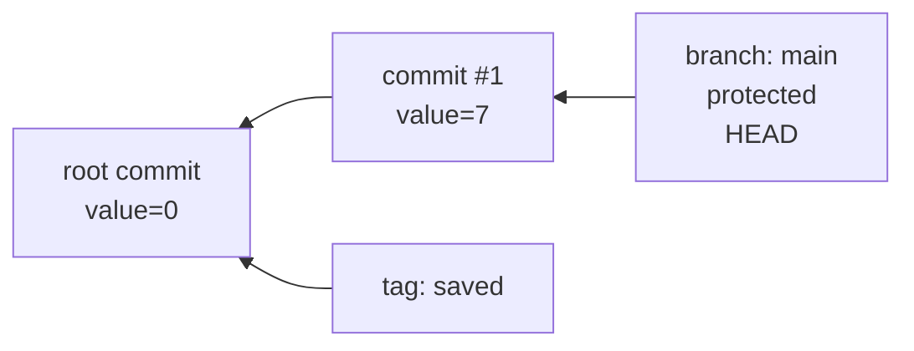
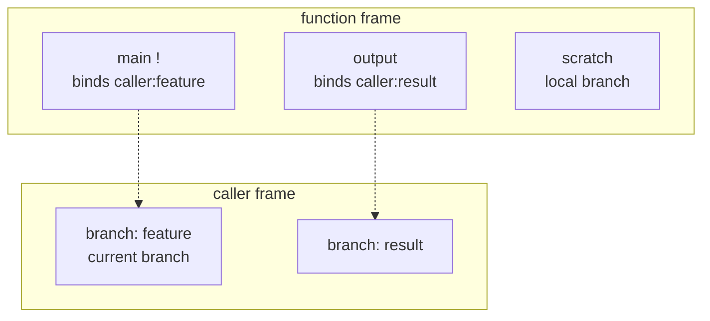
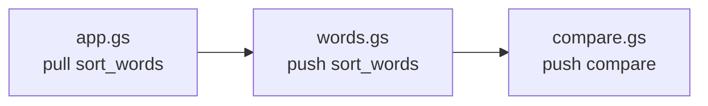
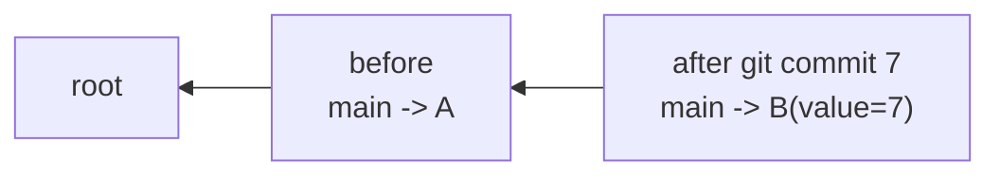
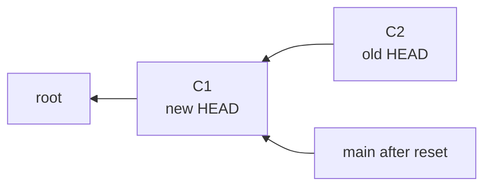
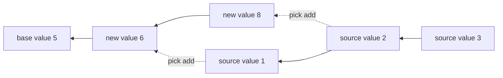
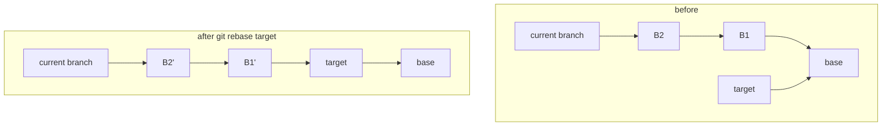
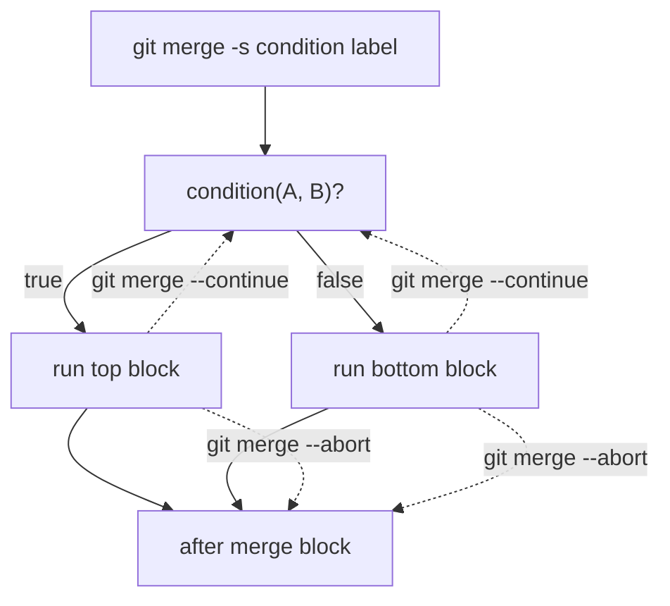

# GitScript Language Specification

GitScript is a small language whose runtime is shaped like a Git repository. A
program does not store variables in ordinary slots. It stores integers in
commits, names those commits with branches and tags, and uses history traversal
as its addressing system.

## Runtime Memory Model

### Commits

A commit is the unit of memory.

Each commit stores:

* an integer value
* a parent commit, except for root commits
* a creation number used to sort history from newest to oldest

Commit values can be read as integers or as Unicode codepoints. String commands
are implemented by creating one commit per character.



The parent link gives GitScript its stack-like flavor. `HEAD~1` means the parent
of the current commit. `HEAD~5` means the fifth ancestor. `HEAD~other` uses the
integer value of `other` as the depth.

### Branches, Tags, and HEAD

Branches and tags are references to commits.

* A branch is mutable. Commands such as `git commit`, `git reset`, and
  `git rebase` move branches.
* A tag is a named reference to a commit.
* `HEAD` is not a branch name. It always means the tip of the current branch.

The global repository starts with a root commit and a protected `main` branch.



### Execution Frames

Global code runs in the global frame. A function call creates a new frame.

Each frame owns:

* local branches
* local tags
* parameter bindings
* scoped debug config values

Function frames inherit the caller's commit and merge verbosity values, then can
change them locally without changing the caller.

The name `main` is special:

* at global scope, `main` is the initial protected branch
* inside a function, `main` is a protected binding to the caller's current branch

This makes the caller's active branch available to a function without letting the
function delete it.



When a function returns normally or exits with `exit`, its local branches and
tags disappear. Branches and tags in caller frames are visible only when passed
as parameters, except for the caller's current branch through `main`.

### Alias Contexts and Imports

Functions and shortforms share an alias namespace. A file also has an import
context, built from local alias definitions and explicit `git pull` statements.
Only the last definition of each alias in that file matters.

Files expose aliases with `git push`. Pulling from a file imports only pushed
aliases, and only aliases requested by name.



The loader caches aliases by source file and builds a dependency DAG. If loading
a file would create an import cycle, loading fails.

## Lexical Basics

### Identifiers

Branch names, tag names, alias names, labels, and parameter names are
identifiers.

Valid identifiers:

* contain only `A-Z`, `a-z`, `0-9`, `-`, `_`, and `/`
* do not start with `-`
* are not `HEAD`
* are not GitScript keywords, separators, ref operators, merge conditions, or
  cherry-pick strategies

For example, `git`, `commit`, `merge`, `is`, and `max` are not valid
identifiers.

The name `main` can be passed as a protected branch argument, but it cannot be
used as a parameter name.

### Integer Literals

Integer literals are decimal integers.

`true` and `false` are integer literals:

* `true` = `1`
* `false` = `0`

### String Literals

Double-quoted strings use ordinary escaping.

Triple-quoted strings are literal multiline strings:

```gitscript
git commit -m """this is a multiline string
and " does not need to be escaped"""

git commit -m """
this one includes the surrounding newlines
"""
```

Triple-quoted strings:

* may span multiple source lines
* may contain unescaped `"` characters
* may contain `&&` and `||` without creating statement separators
* may be written after `-m` or `-m=`

The string contains exactly the characters between the opening and closing
`"""`.

### Comments and Separators

Comments and whitespace are discarded by the lexer, except for newlines separate
statements.

In order of precedence, statement separators are:

* newline
* `&&`
* `||`

## Addressing History

### Commit References

```text
<commit-ref> =
    HEAD
  | <branch-name>
  | <tag-name>
  | <commit-ref>~<non-negative-int>
  | <commit-ref>~<commit-ref>
  | <commit-ref>^
  | (<commit-ref>)
```

Semantics:

* `HEAD` is the current branch tip
* a branch name is that branch's tip
* a tag name is the tagged commit
* `<ref>~N` moves `N` ancestors backward
* `<ref>^` is sugar for `<ref>~1`
* `<ref>~N` is a runtime error if the commit has fewer than `N` ancestors
* `<ref>~<other-ref>` evaluates `other-ref` to an integer depth, then moves that
  many ancestors backward
* `~` associates right-to-left

Example:

```gitscript
HEAD~(foo~1)
```

### Chaotic Addressing

Because a commit value can become a history depth, addresses can be computed from
other addresses:

```gitscript
HEAD~(spaces~3)
```

This supports dynamic indexing, pointer-like structures, and deliberately
chaotic access patterns.

### Commit Selectors

```text
<commit-range> = <commit-ref>..<commit-ref>
<symdiff-range> = <commit-ref>...<commit-ref>
<commit-selector> = <commit-ref> | <commit-range> | <symdiff-range>
```

`A..B` selects every commit reachable from `B`, including `B`, except commits
reachable from `A`. If `A` and `B` are the same commit, the range is empty.

`A...B` selects the symmetric difference: commits reachable from either side,
excluding commits reachable from both sides.

Commands that take history selectors can take multiple selectors. The selected
set is computed as follows:

1. For `git log` and `git rev-list`, a plain `<commit-ref>` includes every
   commit reachable from that ref.
2. For `git cherry-pick` and `git revert`, a plain `<commit-ref>` includes only
   that one commit.
3. `A..B` includes commits reachable from `B`.
4. `A..B` excludes commits reachable from `A`.
5. `A...B` includes commits reachable from either side.
6. `A...B` excludes commits reachable from both sides.
7. Exclusions win over ordinary selector inclusions.
8. For commands that support `--all`, `--all` includes every commit reachable
   from any ref visible in the current frame and overrides range exclusions.

The final set is sorted newest creation first unless a command says otherwise.

## Loading Files and Managing Imports

### `git init`

```gitscript
git init
```

`git init` is valid only at global scope. It resets the repository to a clean
state:

* root commit only
* protected `main` branch at root
* no other branches or tags
* no aliases or functions
* debug config reset to defaults

It does not change `core.worktree`.

### `git clone`

```gitscript
git clone <file-path>
```

`git clone` is a global-only preprocessor directive. It behaves like pasting
another GitScript file at the current source position, with `git init` prepended
to the pasted file.

When used in the REPL, it behaves as though the user typed `git init` followed by
the target file contents.

GitScript tracks files currently being expanded. Cloning fails if it would create
an infinite cycle, including a cycle back to the initial file.

When a cloned file is loaded, GitScript also inserts worktree changes around the
pasted contents:

```gitscript
git config core.worktree <directory-of-cloned-file>
...
git config core.worktree <previous-worktree>
```

### `git pull`

```gitscript
git pull <file-path> <alias-name>...
git pull <file-path> <local-alias>:<source-alias>...
```

`git pull` is valid only at global scope. It imports pushed aliases and functions
from another file. It does not execute non-alias statements from that file.

At least one alias name is required. There is no import-all form.

Every requested source alias must:

* exist in the pulled file's final alias context
* be exposed by `git push` in that file

`local:source` imports `source` under the local name `local`.

Imports are dynamic and cached by file. Loading a file resolves that file's own
imports first, rewrites alias usages in loaded definitions to qualified internal
dependencies, caches the final definitions, and reuses that cache for later
imports. These dependency aliases do not pollute the importing file's visible
alias namespace.

`git pull` participates in a file dependency DAG. A cycle is an error.

### `git push`

```gitscript
git push [<alias-name>]...
```

`git push` exposes aliases or functions from the current file's final alias
context so other files can import them with `git pull`.

It is only meaningful to the import loader. When a file is run directly, it has
no runtime effect beyond requiring global scope.

Pushed aliases must exist in the final alias context. Since `git pull`
contributes to that context, pass-through imports are valid:

```gitscript
git pull lib.gs my_alias
git push my_alias
```

### `git config core.worktree`

```gitscript
git config core.worktree <path>
```

`core.worktree` is the directory used to resolve relative paths for `git pull`
and `git clone`. It is valid only at global scope.

When a file starts loading through the command-line entrypoint, `git pull`, or
`git clone`, GitScript temporarily sets `core.worktree` to that file's directory
and restores the previous value when the file finishes loading.

When the command-line entrypoint is run with `-i`, GitScript runs the file and
then enters REPL mode with the same repository. In that mode, the initial file's
worktree is not restored to the directory where `gitscript` was launched before
the REPL begins.

## Mutating Repository Memory

### `git commit`

```gitscript
git commit [--amend] [<int>]
git commit -m [<string>]
```

Integer commit mode:

* creates one commit with the integer value
* reads an integer literal from stdin if the value is omitted
* supports `--amend`, which uses the current commit's parent as the new parent

String commit mode:

* selected by `-m`, with or without `=`
* reads a single-line string from stdin if the string is omitted
* creates one commit per character
* stores characters in reverse order, so the last character is closest to `HEAD`
* does not allow `--amend`



### Branches and Checkout

```gitscript
git branch
git branch <name> [<commit-ref>]
git branch -d [<branch-name>]...
git checkout <branch-name>
git checkout -b <branch-name> [<commit-ref>]
```

`git branch <name>` creates a branch at the specified commit, or at `HEAD` if no
commit is specified.

`git checkout <branch>` makes a branch current.

`git checkout -b <branch>` creates the branch first, then checks it out.

`git branch -d` deletes branches. Protected branches cannot be deleted.

With no arguments, `git branch` prints visible branches for diagnostics.

Branch listing rules:

* the current branch is prefixed with `*`
* protected branches are marked with `!`
* bindings to caller frames are shown with `->`
* branches are sorted by `(main?, bound?, protected?, name)`
* invisible branches are not listed

Example global output:

```text
   main !
 * feature
```

Example function output:

```text
   main! -> caller:feature
   owner! -> caller:main
   output -> caller:result
 * scratch
```

### Tags

```gitscript
git tag
git tag <name> [<commit-ref>]
git tag -d [<tag-name>]...
```

`git tag <name>` creates a tag at the specified commit, or at `HEAD` if no commit
is specified.

`git tag -d` deletes tags.

With no arguments, `git tag` prints visible tags for diagnostics. Bound tags are
printed first, then tags are sorted alphabetically. Each line shows:

* the tag name
* any caller binding chain
* the commit creation number
* the commit integer value
* the commit character value

### Reset

```gitscript
git reset <commit-ref>
```

`git reset` moves the current branch to the specified commit.



### Cherry-Pick

```gitscript
git cherry-pick <commit-selector> [<commit-selector>]... [-s <strategy>]
```

`git cherry-pick` creates new commits from selected commits. `--all` is not
supported.

The selected set is replayed oldest to newest. The default strategy is `theirs`.

Strategy inputs:

* `ours` is the current `HEAD` value
* `theirs` is the next selected commit value

Strategies:

* value selection: `theirs`, `ours`, `min`, `max`
* arithmetic: `add`, `sub`, `mul`, `div`, `mod`
* comparison, returning `0` or `1`: `gt`, `lt`, `gte`, `lte`, `eq`, `neq`

For a range, the strategy acts as a reduction. Cherry-picking values `[1, 2, 3]`
onto a current value of `5` with `-s=add` creates `[6, 8, 11]`.



Division and modulo by zero are runtime errors.

### Revert

```gitscript
git revert <commit-selector> [<commit-selector>]...
```

`git revert` appends one commit per selected commit, using the negated value of
that selected commit. `--all` is not supported.

The selected set is iterated newest to oldest.

### Rebase

```gitscript
git rebase <commit-ref>
```

`git rebase` replays commits from the current branch onto the target commit.
Every commit on the current branch that is not reachable from the target is
recreated, preserving values but giving the replayed commits new identities and
new creation numbers.



After ref movement operations such as `reset` and `rebase`, unreachable commits
are eligible for GitScript garbage collection.

## Observing Repository Memory

Diagnostic output is decorated with ANSI color where supported. Branch names,
tag names, parameter names, commit values, and config headings use consistent
color categories. Program output from `git show`, normal `git log`, and
`git rev-list` remains usable as program output.

### `git show`

```gitscript
git show [<commit-ref>]
```

Prints the integer value of a commit. The default ref is `HEAD`.

### `git log`

```gitscript
git log [-n <non-negative-int>] [--reverse] [--oneline] [--all] [<commit-selector>]...
git log [-n <non-negative-int>] [--graph] [--all] [<commit-selector>]...
```

Without selectors, `git log` uses `HEAD`.

For normal log output, selected commit values are interpreted as characters.

Traversal:

* default: newest to oldest
* `--reverse`: oldest to newest

`-n` limits output after sorting and after `--reverse` is applied.

By default, `git log` prints a trailing newline. `--oneline` omits it, which is
useful for prompts before `git commit` and `git commit -m` read stdin.

### `git log --graph`

`--graph` prints a diagnostic ancestry graph instead of character output.

It is incompatible with:

* `--oneline`
* `--reverse`

It accepts `-n`, `--all`, and commit selectors.

Each graph line represents one selected commit and shows:

* a box-drawing ancestry graph for visible selected commits
* whether the commit is current `HEAD`
* visible branches pointing at the commit
* visible tags pointing at the commit
* commit parameters pointing at the commit
* the commit creation number
* the integer value
* the character value, escaped for line-oriented display

Refs outside the current frame are not shown. Function-local refs that have gone
out of scope are not shown. Commit parameters are shown because `-c` parameters
bind concrete commits at call time.

Graph layout rules:

* once history branches, that line of commits is drawn in a separate column
* GitScript uses the first free column to the left, or creates a new left column
* unrelated selected histories are drawn in separate columns
* the exact connector layout is implementation-defined but stable for a selected
  set and creation history

Example shape:

```text
* 5 value=5 char='\x05' [HEAD -> b]
┃ * 4 value=4 char='\x04' [branch:main !]
┃ ┃ * 3 value=3 char='\x03' [branch:a]
┣━┿━* 2 value=2 char='\x02'
┣━* 1 value=1 char='\x01'
* 0 value=0 char='\0' [tag:root]
```

### Command-Line Visualization

```sh
gitscript -v <file-path>
gitscript -v
gitscript -v -i <file-path>
```

The `-v` flag opens a PyVis window showing the complete commit graph while the
program runs. The graph is zoomable and pannable.

Commit nodes are placed chronologically from bottom to top: older commits are
lower, newer commits are higher, matching the reading order of
`git log --graph --all`.

The visualizer shows commits reachable from at least one branch or tag on any
active stack frame, including global refs, function-local refs, and branch or tag
bindings. Commits that are no longer reachable from any branch or tag are not
shown.

Branches, tags, and `HEAD` are shown as separate pointer nodes. Branch nodes,
tag nodes, and `HEAD` nodes use distinct visual styles. `HEAD` points to the
branch it has checked out. In a function, the current frame's head is labelled
`HEAD N`, where `N` is the stack frame number, while saved caller heads keep the
caller frame's number. The global caller head is labelled `HEAD`. A branch or
tag binding points to the caller-frame branch or tag it is bound to, and that
target ref stays opaque even when it is outside the current frame.

When execution is inside a function frame, commits, edges, branches, and tags
outside the current frame are shown translucently. Saved `HEAD` positions from
caller frames are also shown translucently.

The graph updates after commit creation, branch movement, checkout, reset,
branch and tag creation or deletion, rebase, `git init`, and function frame
entry or exit.

### `git rev-list`

```gitscript
git rev-list [-n <non-negative-int>] [--reverse] [--all] [<commit-selector>]...
```

Prints selected commit values as integers, one per line. Without selectors,
`git rev-list` uses `HEAD`.

`-n` limits output after sorting and after `--reverse` is applied.

### `git config`

```gitscript
git config
git config commit.verbose <int>
git config merge.verbosity 0
git config merge.verbosity 1
git config merge.verbosity 2
git config core.worktree <path>
```

With no arguments, `git config` prints visible configuration for diagnostics:

* `commit.verbose`
* `merge.verbosity`
* `core.worktree`
* visible shortforms, listed by name
* visible functions, listed by name and parameter types

Internal imported dependency aliases are not shown.

`commit.verbose` and `merge.verbosity` are scoped to the current execution frame.
Function calls inherit the caller's current values, then isolate changes.

`commit.verbose` defaults to `0`. When nonzero, every new commit is logged,
including commits created by string commits, cherry-pick, revert, rebase, and
amend.

`merge.verbosity` defaults to `0`:

* `0`: no merge debug logging
* `1`: log merge block entry and conditional checks
* `2`: log everything from `1`, plus continues and aborts

## Control Flow

### Merge-Conflict Blocks

```gitscript
git merge [-s <condition>] [<label>]
<<<<<<< <commit-ref>
    ...
=======
    ...
>>>>>>> <commit-ref>
```
Note: Merge conflict markers and their commit refs must stay on their own lines, mimicking the appearance of actual
merge conflicts. Indentation on these lines is, however, acceptable.

`git merge` starts a control-flow block. The conflict markers provide the two
commit refs being compared.

Conditions:

* `gt`: first value is greater than second value
* `lt`: first value is less than second value
* `gte`: first value is greater than or equal to second value
* `lte`: first value is less than or equal to second value
* `eq`: first value equals second value
* `neq`: first value does not equal second value
* `is`: both refs resolve to the exact same commit object

The default condition is `eq`.

Execution:

1. Evaluate both marker refs.
2. If the condition is true, run the top block.
3. Otherwise, run the bottom block.
4. Reaching the end of the selected block exits the merge statement.



```gitscript
git merge --continue [<label>]
git merge --abort [<label>]
```

`git merge --continue` jumps back to the start of the current merge block.
`git merge --abort` skips to the end of the current merge block.

With a label, continue or abort targets the matching outer merge block, which
allows nested control flow to jump to an enclosing loop.

### Statement Composition

Anonymous blocks can appear anywhere a statement can appear:

```gitscript
'!
  git commit 1
  git show
'
```

The block starts with `'!` and ends at the matching single quote. Blocks can be
nested. A single quote inside a string literal does not close the block.

Anonymous blocks execute immediately in the current frame. They do not create
function frames or local branch/tag scope.

`&&` sequences statements on one physical line:

```gitscript
git commit 1 && git show
```

The right side runs only if the left side succeeds.

`||` runs the right side only if the left side fails with a GitScript error:

```gitscript
git commit || git commit 0
```

`||` catches runtime errors such as invalid integer input, missing refs, missing
ancestors, type errors in function arguments, division by zero, and errors raised
while defining a function body. It does not catch parse errors that prevent the
enclosing block from being parsed.

`exit`, `pause`, `git merge --continue`, and `git merge --abort` are
control-flow or debugging signals, not errors, so `||` does not catch them.

Precedence, from strongest to weakest:

1. anonymous block: `'!...'`
2. sequencing: `&&`
3. error recovery: `||`
4. newline separation

A merge-conflict control structure is one statement for composition purposes.
The `git merge` line and its matching conflict markers and blocks stay together,
even though the statement spans multiple lines.

### `exit`

```gitscript
exit
```

`exit` leaves the current execution block early.

* inside a function, it returns from that function
* at global scope, it ends the program
* inside a merge block, it exits the surrounding function if one exists, or the
  global program otherwise

`exit` is separate from `git merge --abort`, which exits only merge-conflict
blocks.

### `pause`

```gitscript
pause
```

`pause` is a debugging statement. It prints `Paused, press enter to continue.`
to stderr, updates the visualization if `gitscript -v` is active, then waits for
one line of user input. The input is discarded.

## Functions and Aliases

Functions and shortforms are defined with `git config alias.<name>`. They share
one alias namespace. Defining the same alias name again replaces the previous
definition.

Alias definitions are allowed only when executing global code. A function call
cannot define an alias, and a shortform cannot expand to an alias definition.

### Shortforms

```gitscript
git config alias.shortform 'statement-fragment'
```

A shortform rewrites `git shortform ...` to `git statement-fragment ...`.
Arguments after the shortform are appended to the substituted command.

Expansion can happen repeatedly. If the replacement fragment starts with another
shortform or function name, that name is expanded too.

The expanded result must be exactly one composed statement. It may contain
anonymous blocks, `&&`, and `||`, but it cannot expand to multiple
newline-separated statements.

Shortforms are not fully validated when defined. Malformed expansions are
reported when the shortform is called.

### Functions

```gitscript
git config alias.function_name [-i <name>]... [-s <name>]... [-l <name>]... [-b <name>]... [-p <name>]... [-t <name>]... [-c <name>]... [-m <name>]... [-o <name>]... '![statement]...'
```

A function body is an ordered list of statements. Calling `git function_name`
executes those statements in a new frame.

The first statement can appear on the same line as `git config`, and the last
statement can appear on the same line as the closing quote.

Function bodies are syntax-checked when the function is defined.

Function body rules:

* the body cannot define aliases or functions
* each statement must start with `git`, be `pause`, be `exit`, or be an anonymous block
* built-in statements must conform to the spec
* parameter uses must match the declared parameter types

This catches errors such as deleting a protected branch parameter:

```gitscript
git config alias.bad -p target '!
  git branch -d target
'
```

Validation does not prove refs exist for every runtime path, that arithmetic is
safe, or that loops terminate.

### Parameters

Parameter types:

* `-i <name>`: integer literal
* `-s <name>`: string literal
* `-l <name>`: new label in the caller frame; the argument must not currently be
  an existing branch or tag
* `-b <name>`: existing unprotected branch; cannot be `main` or the caller's
  current branch
* `-p <name>`: existing branch, protected inside the callee; may be `main` or the
  caller's current branch
* `-t <name>`: existing tag
* `-c <name>`: commit; the argument is a `<commit-ref>` resolved at call time
* `-m <name>`: merge condition
* `-o <name>`: cherry-pick strategy

Parameter names use identifier syntax and cannot be `main`.

Parameters are referenced by name wherever a value of that type is expected:

```gitscript
git config alias.pick -c source -o strategy '!
  git cherry-pick source -s=strategy
'

git pick main max
```

The `-c` type binds a concrete commit, not a ref expression to be re-evaluated
later. It can be used anywhere a commit reference is expected, including as one
side of a range selector.

### Defaults and Named Arguments

Defaults are declared in the parameter list:

```gitscript
git config alias.foo -i count=1 -s message="ok" '!
  git commit count
  git commit -m message
'
```

Defaults make parameters optional from the right when calling positionally.
Defaults for branch, tag, and label parameters are checked at call time.

Named arguments use long option syntax based on the parameter name:

```gitscript
git foo --message "done" --count 3
git foo 3 --message "done"
```

Named arguments can be mixed after positional arguments. Each parameter may be
supplied at most once.

### Branch and Tag Scope in Functions

Inside a function, branch and tag names resolve in the current frame plus
explicit parameter bindings.

Refs created inside a function are local to that call and disappear when the call
returns. They can shadow global refs without modifying them.

To let a function use a caller ref, pass it:

* use `-b` for an existing unprotected branch
* use `-p` for an existing branch protected inside the function
* use `-t` for an existing tag
* use `-l` for a new caller-frame branch or tag name the function will create

`-l` behaves like a controlled caller-frame declaration. If a function receives
`-l output`, then `git branch output` or `git tag output` creates that ref in the
caller frame, not the callee's temporary frame.

Nested calls create nested frames. A ref from an outer function is not visible to
an inner function unless passed along as a parameter. In every function call,
`main` refers to that call's caller branch.

When a function returns, GitScript restores the caller's previous `HEAD`.

## Garbage Collection and Errors

GitScript automatically removes commits no longer reachable from any branch or
tag. This happens after operations that move refs, such as `reset` and `rebase`.

Runtime errors include:

* division or modulo by zero
* negative offsets
* missing ancestors in `<commit-ref>~N`
* missing branches or tags
* using a tag where a branch is required, or a branch where a tag is required
* invalid function arguments
* import cycles
* invalid global-only commands inside functions
